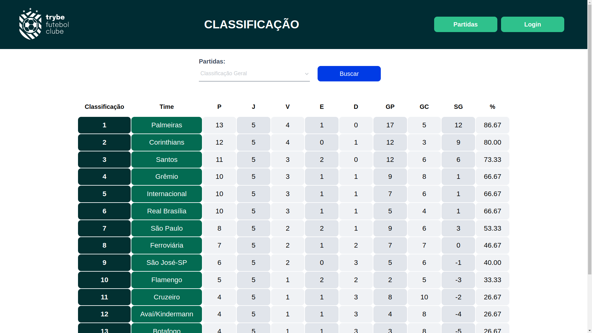
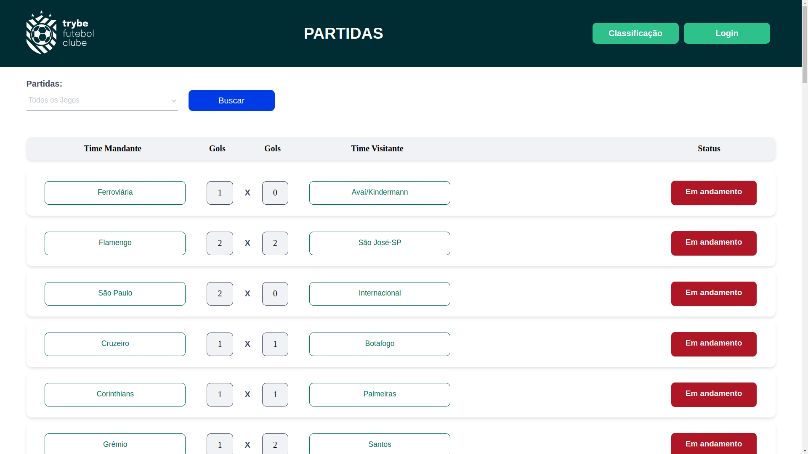

# Projeto Trybe Futebol Clube ⚽

🔗 [Clique aqui e veja este projeto em execução](https://trybe-futebol-clube-dev.vercel.app/)

## Contexto
Este é um site informativo sobre partidas e classificações de futebol, foi desenvolvida durante meus estudos de Back-end na __Trybe__ com o objetivo de consolidar os estudos de __TypeScrypt, programação orientada a objetos (POO) e SOLID__. A API foi desenvolvida com __NodeJs__ e utiliza a arquitetura MSC: Model, Service e Controller. Os __testes__ da aplicação utiliza as bibliotecas __Sinon, Mocha e Chai__.

Neste projeto coube a mim o desenvolvimento do backend da aplicação, desta forma os códigos contidos no diretório __/backend__ foram desenvolvidos por mim enquanto frotend e alguns arquivos de configuração foram fornecidos pela __Trybe__.





## Rotas

Através dessa API é possível manipular informações de times, partidas, usuários e classificações. A relação de rotas e suas respectivas descrições podem ser visualizadas nas tabelas abaixo.

### Login
|Método|Rota|Descrição|
|-|-|-|
|POST|/login|registra novo usuário (retorna um token)|
|GET|/login|retorna as permissões do usuário (requer token)|

<details>
<summary>Como utilizar as rotas que possuem body</summary>

1. Registro de novo usuário

  - O corpo da requisição deverá seguir o formato abaixo:
  
  ```js
  {
    "email": "string",
    "password": "string"
  }
  ```

2. Permissões do usuário
  - A requisição deve possuir um token válido no campo authorizations do headers:

</details>

### Matches
|Método|Rota|Descrição|
|-|-|-|
|GET|/matches|retorna a lista de todas as partidas|
|GET|/matches?inProgress=true|retorna a lista de todas as partidas em andamento|
|GET|/matches?inProgress=false|retorna a lista de todas as partidas finalizadas|
|POST|/matches|registra uma nova partida|
|PATCH|/matches/:id/finish|finaliza a partida especificada|
|PATCH|/matches/:id|atualiza placar de uma partida|

<details>
<summary>Como utilizar as rotas que possuem body</summary>

1. Registro de novas partidas

  - O corpo da requisição deverá seguir o formato abaixo:
  
  ```js
  {
    "homeTeam": 16,
    "awayTeam": 8,
    "homeTeamGoals": 1,
    "awayTeamGoals": 0,
  }
  ```

2. Atualização de placar
  - O corpo da requisição deverá seguir o formato abaixo:
  
  ```js
  {
    "homeTeamGoals": 2,
    "awayTeamGoals": 0
  }
  ``` 
</details>

### Teams
|Método|Rota|Descrição|
|-|-|-|
|GET|/teams|retorna a lista de times|
|GET|/teams/:id|retorna um time especificado|

### Leaderboard
|Método|Rota|Descrição|
|-|-|-|
|GET|/leaderboard|retorna a classificação geral dos times|
|GET|/leaderboard/home|retorna a classificação dos times que jogam em casa|
|GET|/leaderboard/away|retorna a classificação dos times que jogam fora de casa|

## Técnologias utilizadas
- Desenvolvido com: __TypeScript__, __NodeJs__, __Express__
- Banco de dados: __Sequelize com mysql2__,
- Testes: __Sinon__, __Mocha__, __Chai__

## Instalação

Requisitos:
  >- docker compose versão __1.29.2__ ou mais recente.
  >- node versão __16.14.0__ ou mais recente.

O repositório conta com um arquivo docker-compose já configurado para maior comodidade e replicabilidade.

Siga os passos a seguir para ter a aplicação rodando em sua máquina.

1. Clonando o repositório
  ```sh
    git clone git@github.com:brunofpessoa/trybe-futebol-clube.git
  ```
2. Instalando as dependências
  ```sh
    cd trybe-futebol-clube
  ```
  ```sh
    npm run postinstall
  ```
3. Subindo os containers e inicializando os serviços
Em um novo terminal execute:
  ```sh
    npm run compose:up:dev
  ```
4. Criando e populando o banco de dados
  ```sh
    docker exec -it app_backend bash
  ```
  ```sh
    npm run db:reset
  ```
5. Pronto!
O frontend está rodando localmente na porta 3000 e o backend na porta 3001

> Você pode configurar as variáveis de ambiente conforme o arquivo .env.exemple se desejar utilizar outras credenciais, portas etc.


## Testes da aplicação

Toda a aplicação é coberta por testes, para testar a aplicação acesse o terminal do container app_backend com o comando `docker exec -it app_backend bash` e em seguida execute `npm test`

> Os testes foram desenvolvidos com Sinon, Mocha e Chai.

## Contato

Email: `brunofernpessoa@gmail.com`

[LinkedIn](https://www.linkedin.com/in/brunofpessoa/)

[GitHub](https://github.com/brunofpessoa/)
